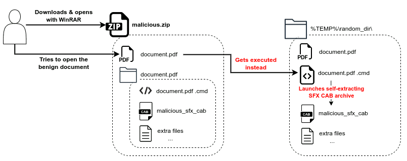
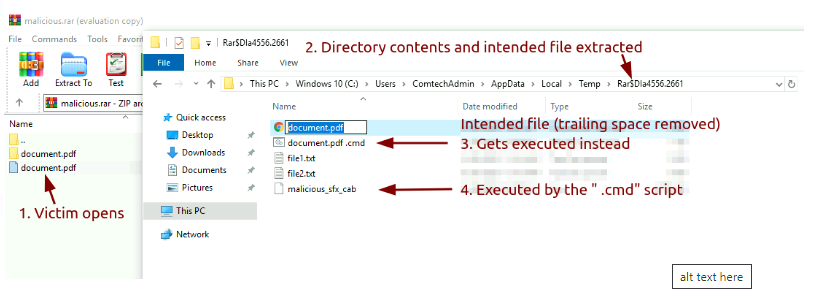

# CVE-2023-38831 WinRAR - Arbitrary Code Execution

Stats:
- CVSS Base Score: 7.8 HIGH
- CVSS Vector: CVSS:3.1/AV:L/AC:L/PR:N/UI:R/S:U/C:H/I:H/A:H

A file extension spoofing vulnerability, discovered in RARLabs WinRAR versions before 6.23.

Leads to an arbitrary code execution when a user attempts to open a benign file within a ZIP archive. 

By modifying archives in a special way, adversaries are able to expolit the vulnerability and launch a malicous script instead of the intended file. 

Specifically crafted malicious archives were posted on trading and crypto-trading forums. 
They were advertised as containing formulas, filters, notes, tool components, etc., for traders to entice them to download and open the archives. 
Archives contained and delivered various malware families, such as DarkMe, GuLoader, and Remcos RAT. 

The potential end goal was withdrawing funds from the victims' brokerage accounts. 

The vulnerability affected WinRAR versions before 6.23. It was fixed in version 6.23.

When a file is executed from within a ZIP archive, WinRAR creates a temporary directory in %Temp%.

As seen in the diagram above, there is a directory and a file under the name 'document.pdf ' (with a trailing space). 
When the benign 'document.pdf' is opened, WinRAR tries to extract the requested file into the temporary directory. 
Due to a bug in filename comparison in one of the WinRAR functions, it extracts both the contents of the document.pdf directory and the requested benign document.pdf into the temporary directory. 

During the extraction, one of the WinRAR functions checks if the filename contains a space at the end -- and removes it if it detects one. 
The benign 'document.pdf ' lands in the temp directory as 'document.pdf' (without) a space at the end.
WinRAR then passes the name of the file to the ShellExecuteExW to be executed. 
The filename passed to this function is 'document.pdf '. 
The intended benign file in the temp directory no longer matches 'document.pdf ' as the trailing space was removed from its filename during the extraction. 
Windows matches 'document.pdf ' to 'document.pdf .cmd' and executes it instead. 

The executed script differs depending on the sample, but usually it searches for and executes some sort of a malicious self-extracting archive that contains the final payload. 

